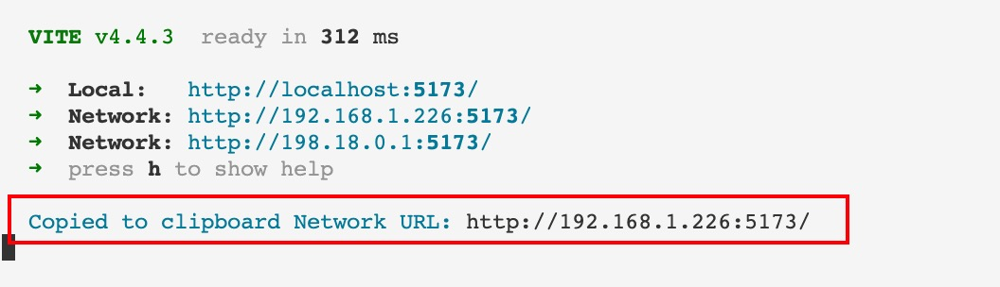

<h1 align="center">vite-plugin-cli-copy</h1>
<p align="center">Start the project and automatically copy the terminal's network URL</p>

<p align="center">
<a href="https://www.npmjs.com/package/vite-plugin-cli-copy" target="__blank"></a>
<a href="https://www.npmjs.com/package/vite-plugin-cli-copy" target="__blank"></a>
</p>

English | [简体中文](./README.zh_CN.md)



## Install

```bash
npm install vite-plugin-cli-copy -D
pnpm add vite-plugin-cli-copy -D
```

## Usage

- package.json

```json
{
  "scripts": {
    "dev": "vite --host"
  }
}
```

- vite.config.ts

```ts
import { defineConfig } from 'vite'
import vue from '@vitejs/plugin-vue'
import cliCopy from 'vite-plugin-cli-copy'

export default defineConfig({
  plugins: [vue(), cliCopy()]
})
```

## Thanks

Great thanks to [@bluwy](https://github.com/bluwy) The project of [vite-plugin-qrcode](https://github.com/svitejs/vite-plugin-qrcode)

## License

[MIT © wChenonly-latest](./LICENSE)
